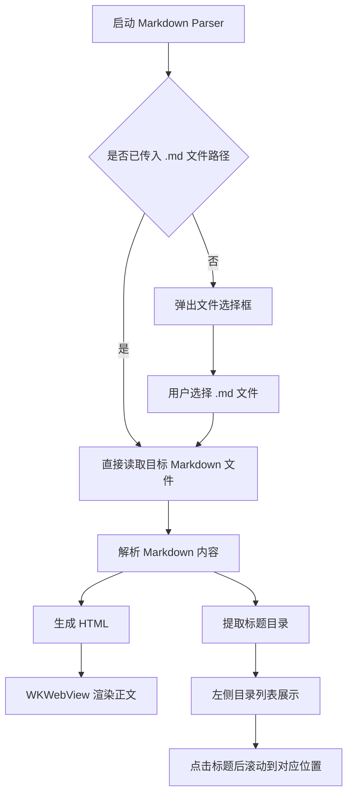
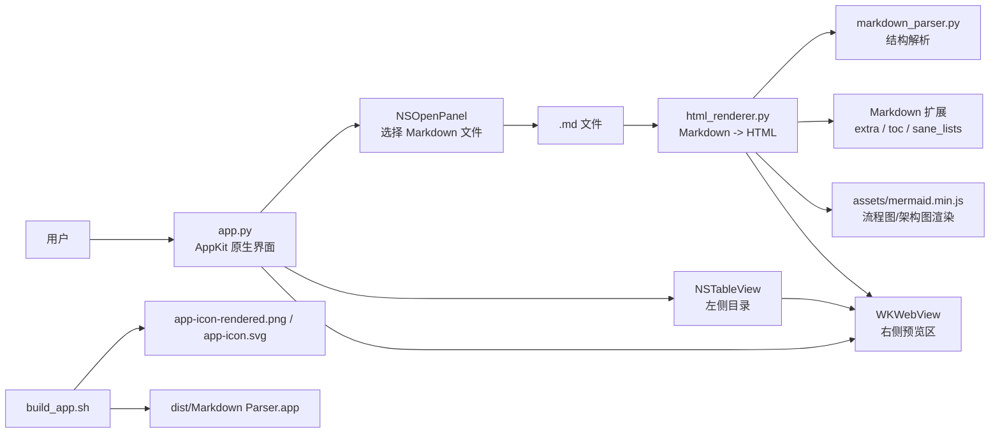
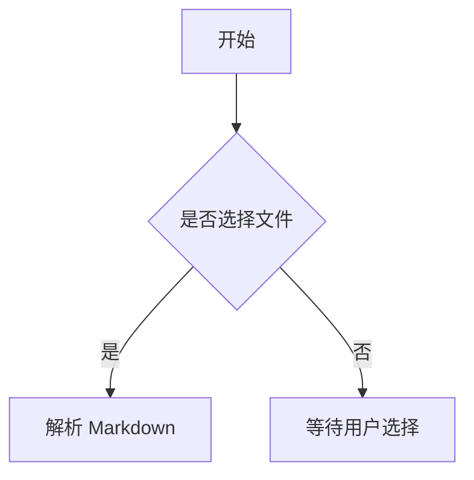

# Markdown Parser

一个基于 Python + `Cocoa(AppKit)` + `WKWebView` 的 macOS Markdown 阅读工具，可直接选择 `.md` 文件并生成可读性界面，最终打包为可双击运行的 `.app`。

## 功能特性

- 选择 `.md` 或 `.markdown` 文件后自动解析并展示
- 左侧显示文档目录，点击标题可快速跳转
- 右侧使用接近 GitHub 的阅读样式展示正文
- 支持标题、段落、引用、无序列表、有序列表、代码块、表格、分割线、链接
- 支持 Mermaid 图表渲染，包括流程图、技术架构图等常见结构图
- 支持打包为 macOS 原生 `.app`
- 应用图标已接入打包流程

## 环境要求

### 运行环境

- 操作系统：macOS 12.7.6
- 架构：Apple Silicon `arm64`
- Python：`3.9.6`

### Python 依赖版本

项目当前固定依赖如下：

```txt
pyinstaller==6.22.3
Markdown==3.4.4
pyobjc-core==11.1
pyobjc-framework-Cocoa==11.1
pyobjc-framework-WebKit==11.1
```

### 打包与系统工具版本

- PyInstaller：`6.22.3`
- Xcode：`14.2`
- Xcode Build version：`14C18`
- `qlmanage`：macOS 自带 Quick Look 工具，用于 SVG 图标回退转换
- `sips`：macOS 自带图片处理工具，用于生成多尺寸图标
- `iconutil`：macOS 自带图标打包工具，用于生成 `.icns`

### 依赖安装

```bash
python3 -m pip install -r requirements.txt
```

## 项目结构

```text
markDownEditor/
├── app.py                    # macOS 原生界面入口
├── html_renderer.py          # Markdown -> HTML / Mermaid 渲染
├── markdown_parser.py        # Markdown 基础解析
├── build_app.sh              # 打包脚本
├── requirements.txt          # Python 依赖
├── assets/
│   ├── app-icon.svg          # 图标源文件
│   ├── app-icon-rendered.png # 图标位图源，优先用于打包
│   ├── app-icon.icns         # macOS 图标文件
│   └── mermaid.min.js        # Mermaid 前端渲染资源
└── dist/
    └── Markdown Parser.app   # 打包产物
```

## 使用方式

```bash
python3 app.py
```

启动后会自动弹出文件选择框；选择 Markdown 文件后，程序会立即解析内容并展示目录与正文。

## 打包方式

```bash
chmod +x build_app.sh
./build_app.sh
```

打包完成后，应用位于：

```bash
dist/Markdown Parser.app
```

## 图标说明

- 图标源设计文件为 `assets/app-icon.svg`
- 为了减少 `svg -> png` 转换偏差，当前项目保留了 `assets/app-icon-rendered.png` 作为位图图标源
- `build_app.sh` 会优先使用 `app-icon-rendered.png` 生成 `.icns`
- 如果没有 `app-icon-rendered.png`，脚本会退回到 `app-icon.svg` 的系统转换流程

## 使用流程图



## 技术架构图



## Mermaid 示例

下面这种流程图和架构图语法，应用内都可以直接渲染：

````md

````

````md

````

## 技术说明

- 当前界面使用 macOS 原生 `AppKit`，避免 `tkinter/Tk` 在当前环境中的兼容问题
- 预览区使用 `WKWebView` 加载 HTML，支持在边框内部滚动
- Markdown 渲染使用 `markdown` Python 库，并启用 `extra`、`toc`、`sane_lists` 扩展
- Mermaid 使用本地 `mermaid.min.js` 进行前端渲染，支持流程图与技术架构图
- 打包使用 `PyInstaller`，输出 `.app` 到 `dist/`
